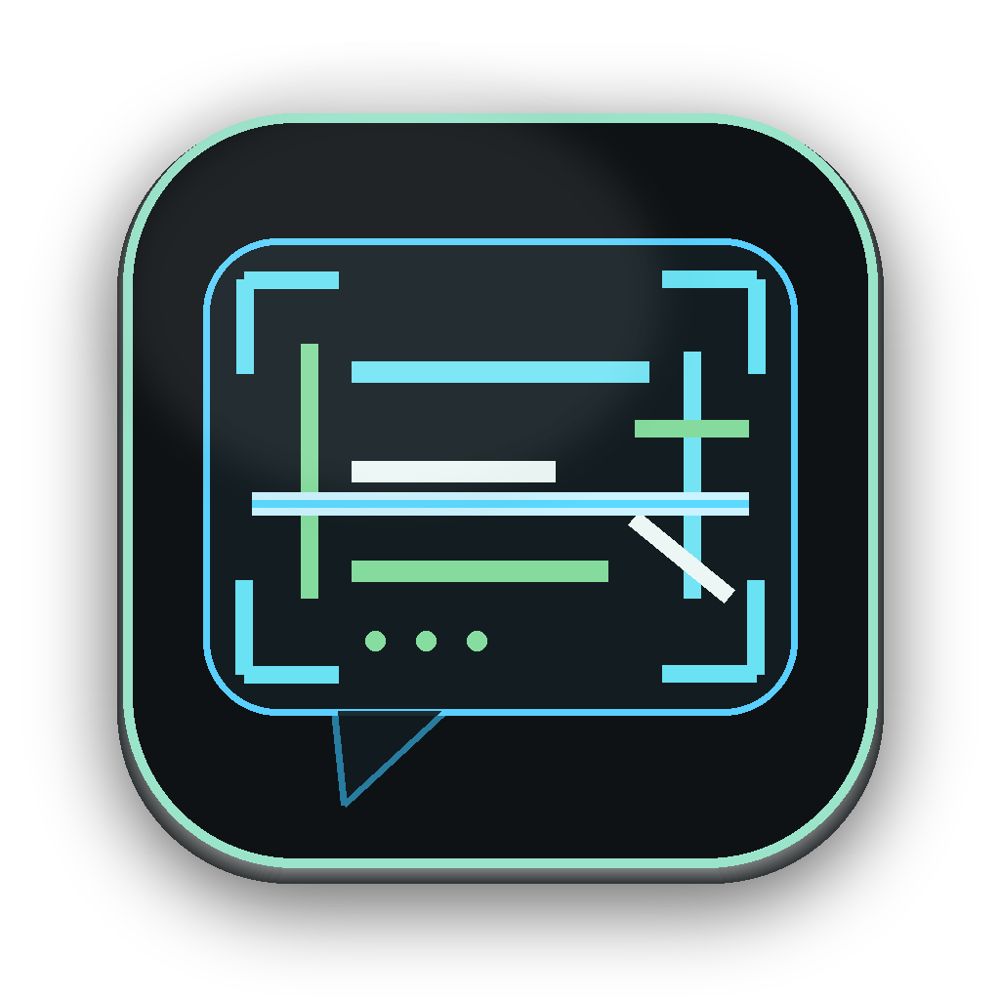
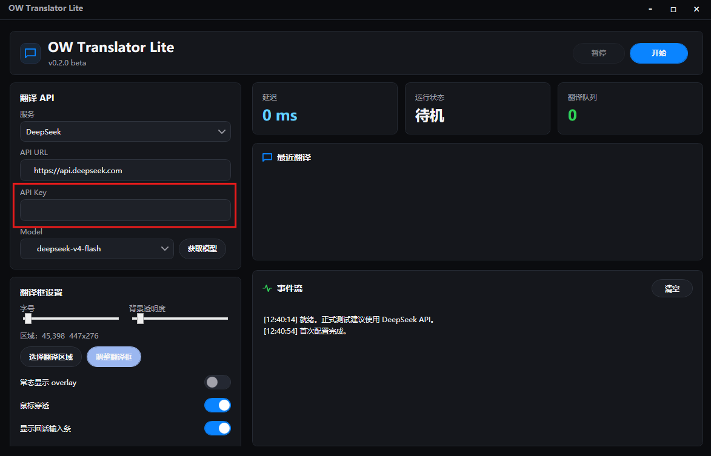
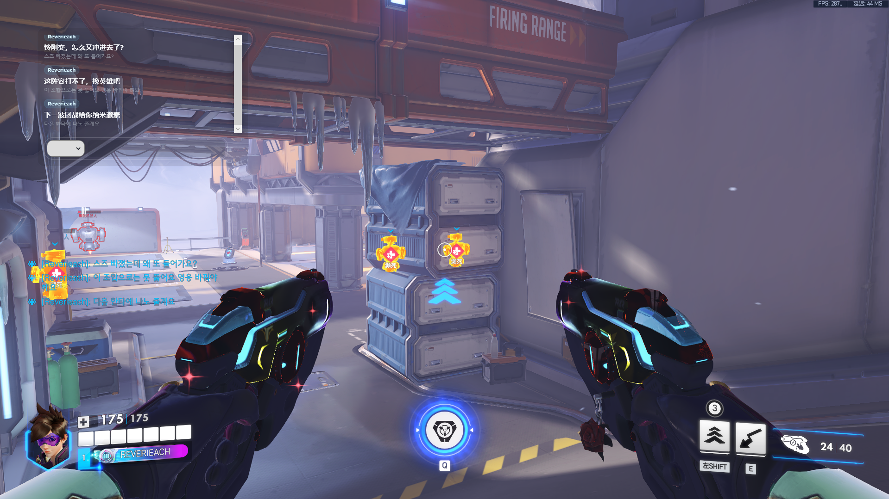
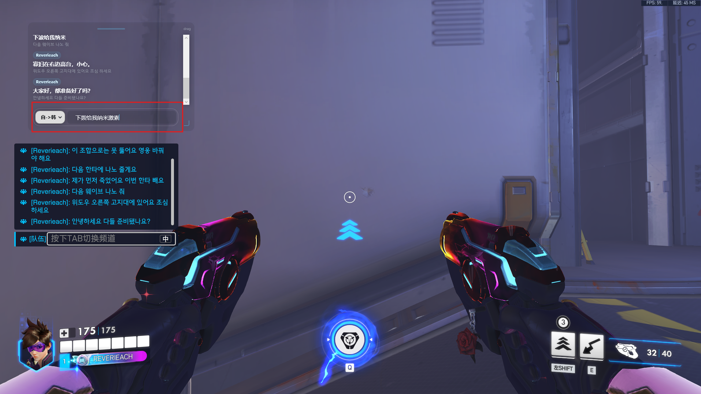

# OW Translator Lite

<p align="center">
  
</p>

<p align="center">
  <strong>面向守望先锋外服聊天的实时 OCR 翻译 overlay</strong><br>
  <span>A real-time OCR translation overlay for Overwatch 2 chat</span>
</p>

<p align="center">
  
  
  
  
</p>

<p align="center">
  <a href="#中文">中文</a> · <a href="#english">English</a>
</p>

---

## 中文

OW Translator Lite 是一个 Windows 桌面工具，用于在《守望先锋 2》外服对局中实时翻译聊天内容。它通过本地 OneOCR 识别你框选的聊天区域，把英语、日语、韩语玩家消息发送到 DeepSeek 或 OpenAI-compatible API 翻译为简体中文，并按原聊天顺序显示在置顶翻译框中。

项目目标很明确：在不打断游戏视野和操作节奏的前提下，让中文玩家能快速理解队友和对手的文字沟通。当前版本为 `v1.0.0`，已经完成 Timeline 顺序对齐、多帧 OCR 共识、韩语 jamo 容错和 Apple Dark Console UI 改造。

### 演示

**主程序配置**



**游戏内实机演示**



**中文回话翻译复制**



### 功能亮点

- **OW 专用聊天识别**：以 `[玩家名]: 正文` 这类玩家消息为翻译单元，过滤系统提示和中文 UI 噪声。
- **本地 OneOCR**：OCR 在本机完成，固定自动识别，不依赖云 OCR。
- **OpenAI-compatible 翻译**：支持 DeepSeek 和 OpenAI-compatible chat completions API。
- **稳定顺序显示**：用 Timeline `Seq` 对齐消息身份，降低开聊天历史、OCR 抖动、多人连续发言时的重复和乱序。
- **韩语友好**：支持去空格比较、Hangul jamo 级相似度、短韩语消息评分和 OCR 混淆容错。
- **低存在感 overlay**：置顶透明翻译框，支持常态显示翻译框、鼠标穿透、拖动缩放和历史滚动。
- **中文回话助手**：在 overlay 底部输入中文，翻译为英语、日语或韩语并复制到剪贴板，由用户自行粘贴发送。
- **更新与反馈**：程序可检查 GitHub Releases 更新；主窗口可导出脱敏反馈包并打开 Bug 反馈入口。
- **深浅外观**：主窗口和快速上手支持深色/浅色主题切换，overlay 仍保持游戏内深色 HUD。
- **本地隐私保护**：API Key 使用 Windows DPAPI 存储，诊断导出会脱敏。

### 快速使用

1. 从 GitHub Releases 下载最新的 `OWTranslatorLite-v*-portable-win-x64.zip`。
2. 解压整个压缩包，运行外层 `OWTranslatorLite.exe`。
3. 建议解压到英文路径，例如 `C:\OWTranslatorLite\` 或 `D:\Tools\OWTranslatorLite\`；如果放在中文路径后 OCR/启动异常，请移动到英文路径再试。
4. 在翻译 API 中选择 `DeepSeek` 或 `OpenAI Compatible`。
5. 填写 API URL 和 API Key；DeepSeek 默认 URL 为 `https://api.deepseek.com`。
6. DeepSeek API 需要充值余额并按量计费，聊天翻译用量通常很小，实际费用很低。
7. 点击“获取模型”，选择模型，例如 `deepseek-v4-flash`。
8. 点击“选择翻译区域”，框选 OW 左侧聊天区域，尽量完整包含玩家名和正文。
9. 点击“开始”，译文会显示在翻译框中。
10. 如需固定显示译文，打开“常态显示翻译框”；如需拖动、缩放或滚动历史，关闭“鼠标穿透”。
11. 如需切换界面观感，可在主窗口左侧“外观”卡片中选择“深色”或“浅色”；游戏内 overlay 会继续保持深色 HUD。

### 更新与反馈

程序会检查 GitHub Releases 中的新版本，并展示版本号、发布时间、更新说明和包大小。你可以选择立即更新、打开发布页、稍后提醒，或对当前版本选择“此版本不再提醒”。

便携包内包含 `OWTranslatorLiteUpdater.exe` 和 `OWTranslatorLiteUninstall.exe`。自动更新会下载最新 `OWTranslatorLite-v*-portable-win-x64.zip`，校验发布包提供的 sha256 后替换外层目录中的 `app/`。更新过程会保留最近一次旧 `app` 备份在 `.update-backup/`，并保留 `%AppData%\OWTranslatorLite` 中的设置、API Key、日志和诊断文件。

自动下载失败时，可以手动把最新 zip 放到外层 `OWTranslatorLite/` 文件夹，再运行 updater 一键替换。

如需卸载，运行外层 `OWTranslatorLiteUninstall.exe`。卸载器会删除当前便携包目录和 `%AppData%\OWTranslatorLite`，包括 API Key、设置、日志、诊断包和 overlay 历史。

遇到问题时，优先在主窗口左侧“诊断工具”中点击“导出反馈包”，再通过“汇报 Bug”打开 GitHub Issue，并把反馈包 zip 拖到 Issue 中。反馈包会脱敏 API Key；只有开启“诊断模式”时才会包含高级 debug 日志。

### 回话输入

打开“显示回话输入条”后，overlay 底部会出现输入栏。输入中文，选择自动、英语、日语或韩语，按 Enter 后程序会翻译回话。默认会自动复制译文；如果关闭“自动复制回话译文”，或剪贴板被微信等程序占用，译文会留在回话输入框中，可点击复制按钮或手动复制。

程序不会自动发送游戏聊天。翻译完成后，请在 OW 聊天框中粘贴，再由你自己按 Enter 发送。

### 实现逻辑

```text
selected chat region
  -> pixel diff patrol
  -> text presence gate
  -> burst OCR
  -> OW chat parser
  -> Timeline alignment
  -> multi-frame consensus
  -> translation queue
  -> Seq-sorted overlay
```

核心思路是把“消息身份”交给有序 Timeline，而不是只靠文本内容判重。OCR 看到的当前聊天区域会被当作权威 Timeline 的可见后缀来对齐；对齐上的就是旧消息，对齐不上的才进入新消息确认流程。

新消息不会立刻发送翻译，而是经过多帧共识：连续两帧一致，或韩语 jamo 距离足够近时才入队。这样可以吸收 OneOCR 对短韩语、空格和相近字符的轻微抖动。

采样侧采用像素 diff 巡逻和轻量文字存在检测：稳定画面只做低成本截图签名，不跑 OCR；检测到聊天区域变化后先判断是否疑似有聊天文字，再进行短突发 OCR。翻译完成后，overlay 按 Timeline `Seq` 排序回填，因此网络延迟或重试不会改变聊天显示顺序。

### 开发者命令

普通用户不需要运行这些命令。下面的命令用于开发、验证或准备测试包，路径均使用仓库相对路径，适合在其他机器或 CI 环境中复用。

```powershell
dotnet build OwTranslateLite.csproj -c Release
```

发布包：

```powershell
powershell -ExecutionPolicy Bypass -File Tools/PackageRelease.ps1
```

回归测试：

```powershell
dotnet run --project Tools/ReplayLab/ReplayLab.csproj -c Release -- --timeline-smoke
dotnet run --project Tools/ReplayLab/ReplayLab.csproj -c Release -- --similarity Tools/ReplayLab/similarity/korean-jamo-regression.json
dotnet run --project Tools/ReplayLab/ReplayLab.csproj -c Release -- Tools/ReplayLab/fixtures/smoke-korean-short Tools/ReplayLab/fixtures/smoke-korean-short/expected.json
dotnet build OwTranslateLite.csproj -c Release
```

期望 fixture 指标：

```text
missing=0, duplicates=0, outOfOrder=0, extra=0
```

### 项目结构

```text
Core/                  设置、Timeline、解析、诊断、翻译协调
Ocr/                   OneOCR 封装与 OW 图像预处理
Overlay/               置顶翻译框
Translation/           OpenAI-compatible / DeepSeek 请求
Resources/             OW 术语表、主题资源、UI 图标、教程截图
Updater/               外层便携更新器源码
Tools/ReplayLab/       离线回放与回归断言
Tools/OcrPreprocessLab/ OCR 预处理实验工具
Docs/                  架构、测试指南、重构记录
```

### 维护文档

- [Architecture](Docs/ARCHITECTURE.md)
- [Timeline Refactor Update](Docs/TimelineRefactor-Update-20260613.md)
- [Replay Case Recording Guide](Docs/ReplayCaseRecordingGuide-20260612.md)
- [Publish Layout](Docs/PublishLayout.md)

---

## English

OW Translator Lite is a Windows desktop app for real-time Overwatch 2 chat translation. It captures a user-selected chat region, recognizes text locally with OneOCR, sends English/Japanese/Korean player messages to DeepSeek or any OpenAI-compatible chat completions API, and renders Simplified Chinese translations in a topmost overlay.

The goal is practical and narrow: help Chinese players understand match chat without interrupting visibility or input flow. The current version is `v1.0.0`, with Timeline-based ordering, multi-frame OCR consensus, Korean jamo tolerance, and an Apple Dark Console UI.

### Demo

**Main App Configuration**


**In-Game Live Demo**


**Chinese Reply Translation**


### Highlights

- **OW-specific chat parsing**: player chat lines such as `[player]: message` are treated as translation units, while system/UI noise is filtered.
- **Local OneOCR**: OCR runs locally with automatic recognition and no cloud OCR dependency.
- **OpenAI-compatible translation**: DeepSeek and OpenAI-compatible chat completions APIs are supported.
- **Stable ordering**: Timeline `Seq` identity reduces duplicates and out-of-order display when chat history is opened or OCR jitters.
- **Korean-friendly matching**: whitespace-insensitive comparison, Hangul jamo similarity, short-message scoring, and OCR confusion tolerance.
- **Low-profile overlay**: topmost transparent translation box with always-show mode, click-through, dragging, resizing, and history scrolling.
- **Reply helper**: type Chinese in the overlay input bar, translate it to English/Japanese/Korean, and copy the result to the clipboard.
- **Updates and feedback**: the app can check GitHub Releases, export a redacted feedback package, and open a bug-report entry.
- **Light and dark appearance**: the main window and QuickStart support light/dark themes; the in-game overlay stays as a dark HUD.
- **Local secret protection**: API keys are protected with Windows DPAPI, and diagnostics redact secrets.

### Quick Start

1. Download the latest `OWTranslatorLite-v*-portable-win-x64.zip` from GitHub Releases.
2. Extract the whole archive and run the outer `OWTranslatorLite.exe`.
3. An English-only extract path is recommended, such as `C:\OWTranslatorLite\` or `D:\Tools\OWTranslatorLite\`. If OCR or startup fails from a path containing Chinese characters, move the folder to an English path and try again.
4. Choose `DeepSeek` or `OpenAI Compatible`.
5. Enter the API URL and API key. DeepSeek defaults to `https://api.deepseek.com`.
6. DeepSeek API usage requires account balance and is billed by usage; chat translation usually costs very little.
7. Click Fetch Models and choose a model such as `deepseek-v4-flash`.
8. Select the OW chat region. Include complete player names and message text.
9. Click Start. Translations will appear in the overlay.
10. Enable always-show translation box if needed. Disable click-through when you want to drag, resize, or scroll the overlay.

### Updates and Feedback

The app checks GitHub Releases for new versions and shows the version, publish time, release notes, and package size before you decide whether to update. You can update now, open the release page, remind later, or ignore the current version until a newer one appears.

Portable packages include `OWTranslatorLiteUpdater.exe` and `OWTranslatorLiteUninstall.exe`. Automatic update downloads the latest `OWTranslatorLite-v*-portable-win-x64.zip`, verifies the release sha256 when provided, and replaces the outer package's `app/` directory. The updater keeps the latest previous `app/` backup under `.update-backup/` and preserves `%AppData%\OWTranslatorLite` settings, API keys, logs, and diagnostics.

If automatic download fails, manually place the latest zip in the outer `OWTranslatorLite/` folder and run the updater to replace the app.

To uninstall, run the outer `OWTranslatorLiteUninstall.exe`. It deletes the current portable package directory and `%AppData%\OWTranslatorLite`, including API keys, settings, logs, diagnostics, and overlay history.

For bug reports, click Export Feedback Package in the Diagnostics Tools section of the main window, then use Report Bug to open a GitHub Issue and attach the generated zip. The package redacts API keys; advanced debug logs are included only when diagnostic mode is enabled.

### Reply Input

When the reply input bar is enabled, type Chinese at the bottom of the overlay, choose Auto/English/Japanese/Korean, and press Enter. By default, the translated reply is copied to the clipboard. If auto-copy is disabled, or the clipboard is occupied by another app such as WeChat, the translated text stays in the reply box for manual copy.

The app does not auto-send game chat. Paste the copied text into OW chat and send it yourself.

### How It Works

```text
selected chat region
  -> pixel diff patrol
  -> text presence gate
  -> burst OCR
  -> OW chat parser
  -> Timeline alignment
  -> multi-frame consensus
  -> translation queue
  -> Seq-sorted overlay
```

The central idea is that message identity comes from an ordered Timeline, not from content equality alone. The currently visible chat region is aligned as a visible suffix of the authoritative Timeline. Lines that align are old messages; lines that do not align become new candidates.

New candidates are not translated immediately. They wait for multi-frame consensus: two consistent observations, or near-equivalent Korean jamo observations, are enough to queue translation. This absorbs light OneOCR jitter around short Korean text, spacing, and visually similar characters.

The capture loop uses pixel-diff patrol plus a lightweight text-presence gate: stable frames only compute a cheap screenshot signature and do not run OCR. When the chat region changes, the app first checks for likely chat text, then runs a short OCR burst. Completed translations are rendered by Timeline `Seq`, so retries and network latency do not reorder the overlay.

### Developer Commands

End users do not need to run these commands. They are for development, validation, and tester package preparation. All paths are repository-relative so they can be reused on other machines or in CI.

```powershell
dotnet build OwTranslateLite.csproj -c Release
```

Publish a release package:

```powershell
powershell -ExecutionPolicy Bypass -File Tools/PackageRelease.ps1
```

Regression tests:

```powershell
dotnet run --project Tools/ReplayLab/ReplayLab.csproj -c Release -- --timeline-smoke
dotnet run --project Tools/ReplayLab/ReplayLab.csproj -c Release -- --similarity Tools/ReplayLab/similarity/korean-jamo-regression.json
dotnet run --project Tools/ReplayLab/ReplayLab.csproj -c Release -- Tools/ReplayLab/fixtures/smoke-korean-short Tools/ReplayLab/fixtures/smoke-korean-short/expected.json
dotnet build OwTranslateLite.csproj -c Release
```

Expected fixture metrics:

```text
missing=0, duplicates=0, outOfOrder=0, extra=0
```

### Project Layout

```text
Core/                  settings, Timeline, parsing, diagnostics, coordination
Ocr/                   OneOCR wrapper and OW image preprocessing
Overlay/               topmost translation overlay
Translation/           OpenAI-compatible / DeepSeek requests
Resources/             OW glossary, theme resources, UI icons, guide screenshots
Updater/               outer portable updater source
Tools/ReplayLab/       offline replay and regression assertions
Tools/OcrPreprocessLab/ OCR preprocessing lab
Docs/                  architecture, test guides, refactor notes
```

### Maintainer Notes

- [Architecture](Docs/ARCHITECTURE.md)
- [Timeline Refactor Update](Docs/TimelineRefactor-Update-20260613.md)
- [Replay Case Recording Guide](Docs/ReplayCaseRecordingGuide-20260612.md)
- [Publish Layout](Docs/PublishLayout.md)

### License

This project is released under the [MIT License](LICENSE).
